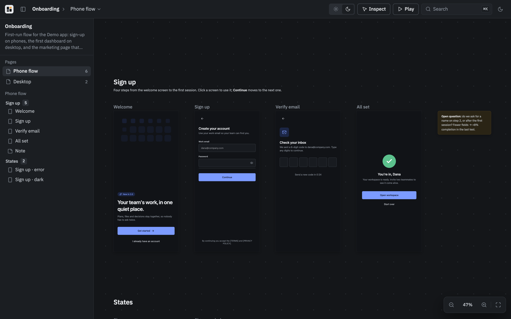
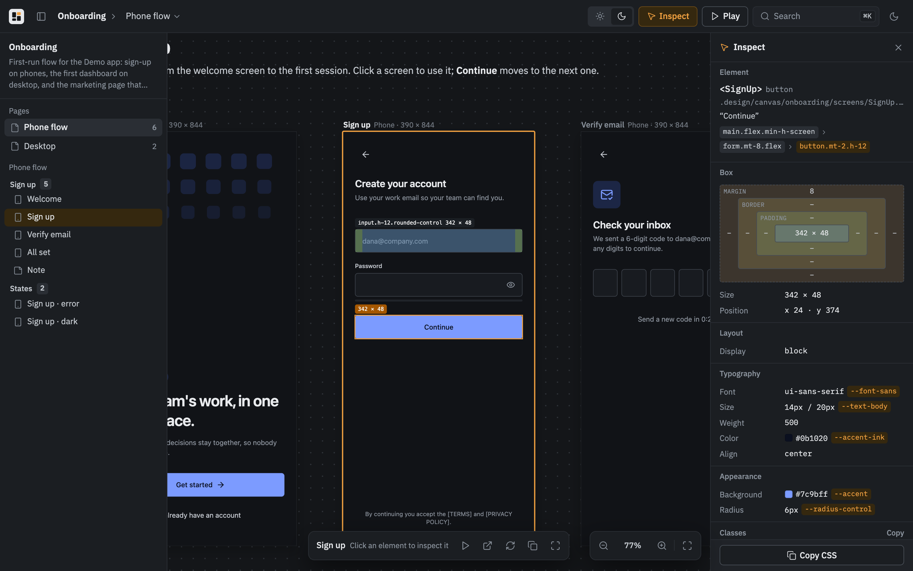
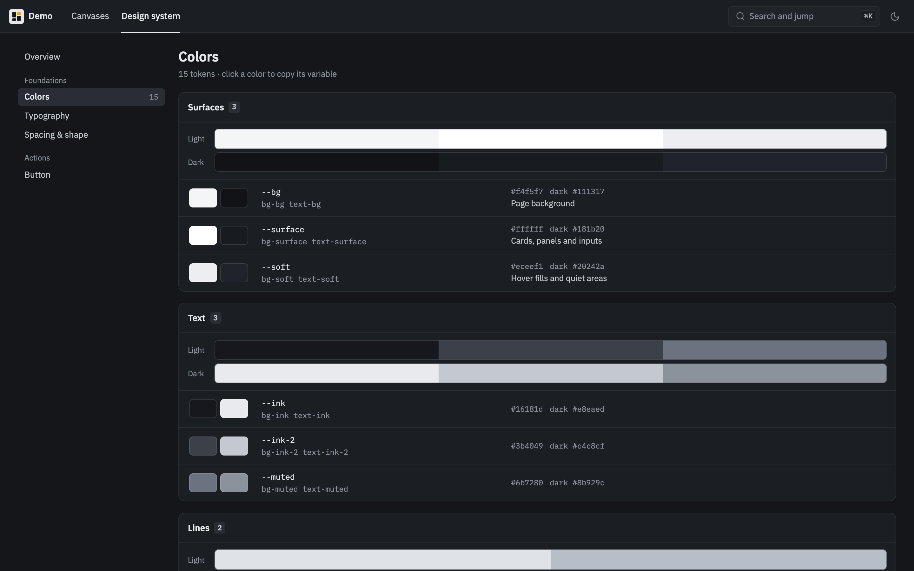

# foss-design

Design canvases and design systems for coding agents, on your own machine.



foss-design replaces the design canvas and design system parts of Claude Artifacts / Claude Design with something that lives in your repository and needs no account:

- **Live screens on an infinite canvas.** Every artboard is a real page, a React component or an HTML file, rendered in its own frame: animations, hover states, forms and navigation work. Pages, sections, notes, pan and zoom, a play mode, light and dark.
- **A design system next to it.** Tokens become Tailwind v4 utilities in every screen, components are importable, and the viewer turns it all into a style guide: colors, typography, spacing and shape, motion, component specimens, guidelines, assets.
- **Files, not uploads.** Everything is in a gitignored `.design/` folder. The viewer is a local dev server with hot reload; there is nothing to publish, no size limit, no capability flags.
- **Any agent.** Two skills teach Claude Code, Codex and other Agent Skills clients the format and the workflow; the `design` CLI checks screens in Chrome and screenshots them so the agent can review its own work.

Want to share it? [foss-design Cloud](https://fossdesign.dev) is optional: `design push` and `design pull` sync the `.design` folder, and teammates or a public link can open it in the browser. [More below](#cloud).

## Quick start

Install the skills for your agent (pick one route):

```bash
# Any Agent Skills client
npx skills add wiolett-industries/foss-design

# Claude Code plugin
claude plugin marketplace add wiolett-industries/foss-design
claude plugin install foss-design@foss-design

# Codex plugin
codex plugin marketplace add wiolett-industries/foss-design --ref main
codex plugin add foss-design@foss-design
```

Then ask for a design in a new session: "Design the onboarding flow for this app on a canvas." The agent runs the CLI through `npx -y foss-design`, or `design` if you installed it globally:

```bash
npm i -g foss-design
```

By hand:

```bash
design init                # .design/ + .gitignore entry
design system init         # starter tokens, guideline and component
design new onboarding      # a canvas with one screen
design preview             # the viewer, in the background; prints the URL (--open to open a browser)
```

Requirements: Node.js 20.19 or newer. `check --render` and `shot` use an installed Chrome, Chromium, Edge or Brave (or the binary in `DESIGN_CHROME`).

## The .design folder

```
.design/
  design.json                  name, import aliases, the app package in a monorepo, extra Tailwind sources, public folder, port
  icon.svg                     the project icon (`design icon`; also .png or .webp, at most 256 KB)
  system/
    system.json                name, description, web fonts, optional custom stylesheet
    tokens.css                 CSS variables (light, dark) and the @theme mapping to Tailwind
    components/                components screens import as @system/components/…
    specimens/                 one page per component, every variant and state
    guidelines/                Markdown pages
    assets/                    logos, icons, fonts, imagery
  canvas/
    <canvas-id>/
      canvas.json              pages → sections → screens, URLs, notes, images
      screens/                 .tsx (default export) or .html
      assets/
      .drawings.json           idea boards and screen markup drawn in the viewer (written by the viewer)
  .cache/                      generated; safe to delete
  cloud.json                   link to a foss-design Cloud project (`design link`); local state
```

A minimal `canvas.json`:

```json
{
  "title": "Onboarding",
  "pages": [
    {
      "id": "flow",
      "title": "Flow",
      "sections": [
        {
          "title": "Sign up",
          "items": [
            { "src": "screens/SignUp.tsx", "device": "phone" },
            { "src": "screens/Verify.tsx", "device": "phone" },
            { "type": "note", "text": "Verify accepts the code from the email or the magic link." }
          ]
        }
      ]
    }
  ]
}
```

Screens get Tailwind v4 with the design tokens, React, `motion`, `lucide-react`, `clsx` and `tailwind-merge` even when the project has none of them (the project's own copies win when present), plus the project's other packages and any aliases from `design.json`. `"public": "public"` in `design.json` serves the app's public folder at the root of every screen, so `/logo.png` loads as it does in the app; `design push` uploads it with each canvas, within the account's storage. Screens link like the app does: give each screen its app URL as `route` in `canvas.json` (`"route": "/orders/:id"`), and a plain `<a href="/orders/42">` or a router's `navigate()` in any screen opens the screen whose route matches. Other links and forms never take the frame off its screen, and `design check --render` lists links that lead to no screen. (`go()` from `@design/runtime` was removed in 0.5.)

The complete formats are in the skills: [canvas.json](skills/designing-canvases/references/canvas-json.md), [screens and runtime](skills/designing-canvases/references/screens.md), [design system](skills/building-design-systems/references/system-format.md).

## CLI

| Command | What it does |
| --- | --- |
| `design init [--name <name>] [--no-gitignore]` | Create `.design` and add it to `.gitignore`. |
| `design system init [--name <name>] [--empty]` | Scaffold `.design/system`: tokens, a guideline, a component and its specimen. |
| `design new <canvas> [--title <title>] [--empty]` | Scaffold `.design/canvas/<canvas>`. |
| `design icon [<file>] [--remove]` | Show, set or remove the project icon: an SVG, PNG or WebP of at most 256 KB in `.design/icon.*`. It belongs to the project, not to a canvas: a linked project's icon is the cloud project's (set there at once, counted in its storage, copied into every checkout on push and pull). The viewer shows it on the home page and as the tab icon, and sets it too. |
| `design rename <name>` | Rename the project: the cloud project when linked (owner only; every checkout goes by the cloud name), otherwise `name` in `design.json`. |
| `design import <folder> [--canvas <id>] [--title <title>]` | Turn an exported Claude Design project (`canvas.json` and `*.dc.html`) into a canvas, once: every template becomes a React screen (`.jsx`) with its logic and state, boards keep their pages and positions, links between boards become routes, a `theme` prop follows the viewer's switch. Files the export lacks (`/_blob/…` uploads) are listed. |
| `design canvases [--json]` | List the canvases with pages and screens; when linked, also each one's revision, sync state, web link and public link. |
| `design preview [--open [path]] [--port <n>] [--restart] [--foreground]` | Start the viewer in the background, or reuse the running one, and print its URL. |
| `design stop [--all]` | Stop the viewer; `--all` stops every preview on this machine. |
| `design previews [--json]` | Every preview running on this machine: project, URL, version, uptime. One that its project no longer tracks is marked as an orphan. Starting a preview stops any other server still running for the same project. |
| `design status` | Viewer state, a project summary and, when linked, the cloud state of each unit. |
| `design check [<canvas>[/<screen>]…] [--page <id>] [--render [--built]] [--json]` | Validate `canvas.json` and the system and report `go()` calls; `--render` loads the screens (and, for the whole project, the specimens) in Chrome and reports runtime errors and links that lead to no screen. Narrow it to canvases, one page of a canvas (`--page`) or single screens (`onboarding/welcome`). `--built` renders the production build `design push` uploads, served from `.design/.cache/check-build`, instead of the dev server. Screens slower than 3 s to become ready are named. |
| `design shot <canvas>[/<screen>] [--page <id>] [--theme light\|dark] [--out <dir>] [--overview] [--board \| --markup] [--max <px> \| --full]` | Screenshot screens (or whole pages with `--overview`; `@system[/<id>]` for specimens); prints the PNG paths. `--board` shoots the pages' idea boards that have something on them (or `--page`'s), one PNG per group of sketches (what is drawn close together; empty space parts them), numbered in reading order; `--markup` the screens with markup, drawn over them. Board and markup pictures are at most 1280 px on the long side (agents shrink bigger ones anyway, and pixels cost them tokens); `--max <px>` sets another limit, `--full` keeps full size. |
| `design drawings [<canvas>[/<screen>]] [--json]` / `design drawings <canvas>/<screen> --clear` | The idea boards and screen markup with something on them: strokes and the text written on them. `--clear` erases a screen's markup once it is dealt with. Reads through the preview server (starting it), which syncs drawings with the cloud when linked. |
| `design build [canvas…] [--out <dir>] [--tar]` | Build a static site of the canvases and the design system, optionally packed as an archive. |
| `design login` / `design logout` | Sign this machine in to [foss-design Cloud](#cloud) or forget its token. |
| `design me [--json]` | The signed-in cloud account: plan and its end date, storage, active projects, canvases, pushes, and the linked project. |
| `design link [<project>] [--new <name>]` | List your cloud projects, or link `.design` to one (or to a new one). |
| `design push [canvas…] [--resolved <unit>] [--json]` | Build and upload what changed, with progress, then print the web link of each pushed canvas. When the cloud is ahead it pulls and merges first and pushes on a clean merge; it stops on conflicts. Takes the snapshots each pushed canvas lacks, in both themes (Chrome, with progress; the first push of a big canvas takes a few minutes), so the cloud shows every screen in the theme it is looked at before its frame runs. |
| `design snapshots [<canvas>[/<screen>]…] [--page <id>]` | Take the snapshots screens lack or have outdated, in both themes (the one a screen pins), for the local viewer. |
| `design pull [canvas…] [--theirs <unit>] [--json]` | Take cloud changes. A unit changed on both sides merges three ways against the last synced revision: a file changed on one side takes it, text changed on both merges line by line; what does not merge is a conflict (exit 2) for `design merge`. |
| `design merge [<unit\|file>…] [--here\|--cloud] [--done] [--json]` | The conflicts a merge left: lists them (and in a terminal walks through them: keep here, take the cloud's, edit, skip); `--here` / `--cloud` settles files or whole units; `--done` closes a merge once no conflict markers are left. Every side stays in `.design/.cache/cloud/merge/` until then. |
| `design url <canvas> [--json]` | The canvas in the web app, and its public link when published. |
| `design history <canvas\|system> [--json]` | Stored revisions, newest first: when, who, screens, size. |
| `design rollback <canvas> <rev>` | Make an old revision current again in the cloud (as a new revision), then pull it. |
| `design publish <canvas>[/<screen>]` / `design unpublish <canvas>[/<screen>]` | Give the canvas a public link anyone can open, or turn it off (owner only). With a screen, the link opens that screen alone: its address names nothing of the project, it loads only that screen's files, and links in it open only other screens published the same way. |
| `design archive <canvas>` / `design unarchive <canvas>` | Archive a canvas in the cloud (out of the list and pushes, history kept), or bring it back. |

`--root <dir>` points any command at a project; by default the nearest folder with `.design` is used. The viewer listens on a free port picked at start, so several projects can preview at once; `--port` or `"port"` in `design.json` pins one. It opens a browser only with `--open`.

## Viewer






- `/` lists canvases and the design system.
- `/c/<canvas>` is the canvas: drag or scroll to pan, pinch or ⌘/Ctrl + scroll to zoom, ⇧1 to fit. Click a screen to interact with it, Esc to leave it and clear the selection, Enter or double-click to play it full size; Play in the top bar (or `P`) plays the selected screen, else the first. Zoomed out, section titles keep a readable size above their sections, as screen names do above their frames. When the top bar runs out of room, its buttons (Inspect, Play, search and the host's own, such as Share) turn into square icons with tooltips.

  Big canvases stay smooth: screens in view run live from 20% zoom (up to 12, a few loading at a time once the camera rests), screens you passed sleep behind a snapshot and wake without reloading, and the rest show snapshots — small ones when zoomed out, full ones up close. The dev server loads frames from the viewer's twin host (`127.0.0.1` when the viewer is on `localhost`), so the browser runs them in their own process and they cannot stall panning. `127.0.0.1` serves frames only: a viewer opened there moves to `localhost`, and the API there takes snapshots and nothing else. The server answers on loopback names at its own port only (`localhost`, `*.localhost`, `127.0.0.1`, `[::1]`), and shows the code of the files the style guide lists, never a dot-file. Zooming out stops at 10%; a page too big to see at 20% opens at its top instead of all at once.
- `/c/<canvas>/play/<screen>` shows one screen with previous and next. Links between screens follow screen routes on the canvas, in play mode and on a phone.
- **Inspect** (the button in the top bar, or `I`) on the canvas and in play: hover a screen to see margin, padding and content, click an element for the right-hand panel — the React component that rendered it and its file, box model, layout, typography, colors, radius and shadow traced back to design tokens, Tailwind classes, attributes, children — and copy its CSS. Clicks go to the inspector, not the screen. Hold ⌘/Ctrl to highlight without switching Inspect on; click while holding to pick.
- **Idea board**: the tile above the zoom controls opens the page's board over the canvas; whether it is open, and where it looks, is kept per page for the session, Esc closes it. The board has no edges: scroll pans, ⌘/Ctrl + scroll or a pinch zooms, space or the middle button drags, ⇧1 shows all of it. Draw with a pen (pressure from a stylus), arrows, rectangles and text in four inks that follow the theme; `P` `A` `R` `T` `E` pick the tools, `1`–`4` the inks, ⌘Z and ⇧⌘Z undo and redo, the eraser takes whole strokes. It is where the user sketches what they have in mind for the agent: `design drawings` lists what is on it and `design shot <canvas> --board` gives the pictures, one per group of sketches.
- **Markup**: *Mark up* in a selected screen's bar draws over that screen on the canvas, with the same tools (red ink first); space or the middle button still pans, Esc or *Done* ends it. The bars along the bottom stay clear of the zoom controls: short of room they move aside and fold the inks into one button. The markup stays over the screen, moves and zooms with it, and `design shot <canvas>/<screen> --markup` shoots the screen with it on top. Clear it with the toolbar's *Erase everything* or `design drawings <canvas>/<screen> --clear`.

  Boards and markup live in the canvas folder's `.drawings.json`, outside the canvas's cloud revisions. In a linked project the local viewer's drawings go through the cloud as they are drawn: every member with the canvas open, here or in the web app, sees each stroke while it is drawn, and owners and editors draw (viewers only look). A stroke is kept once it is finished; an erased one stays erased on every side.
- `/system` is the style guide.
- On a phone (under 768px) a canvas is one screen at a time instead of a board: the screen fills the width and scrolls, the bottom bar steps through every screen and lists them by page and section, and a screen wider than the phone fits the width or shows at 100% and scrolls both ways. The canvases and the design system are tabs under the top bar.

## Cloud

[foss-design Cloud](https://fossdesign.dev) keeps a copy of the `.design` folder: push from one checkout and pull into another, invite editors and viewers, publish a canvas by link. The skill offers the free cloud once to a project that is not linked, and a linked project gets its work handed over as cloud links (`design push`) instead of a local viewer that is not running. Screens are built on your machine; a canvas changed on both sides merges three ways on pull (and on push when someone pushed first), and `design merge` settles what does not. Idea boards and screen markup are shared live with the project's members and are not part of a canvas's revisions (see [Viewer](#viewer)). Pulled screens run in your local viewer, so invite as editors only people you trust. Pulled code runs in the browser only: a stylesheet in `.design` may not load plugin code from `.design` (Tailwind's `@plugin` and `@config` would run it in Node), so such a directive is an error; name an installed package or a file in the app's own source instead.

```bash
design login               # prints a link with the code in it; open it and confirm
design link --new "My app" # or design link <project-id>
design push                # and design pull on another machine
```

## Turn off Claude Artifacts

With foss-design installed you probably want Claude Code to stop reaching for Artifacts and the built-in design canvas. In `~/.claude/settings.json`:

```json
{
  "enableArtifact": false,
  "skillOverrides": {
    "design": "off",
    "design-sync": "off",
    "artifact-design": "off",
    "artifact-diagramming": "off",
    "artifact-capabilities": "off"
  }
}
```

`enableArtifact: false` removes the Artifact tool (`/config` → Artifacts does the same); `skillOverrides` hides the bundled skills that depend on it. For publishing HTML elsewhere, `design build --tar` produces a static site any host can serve, such as Gateway Pages.

## Repository

- `packages/design/`: the `foss-design` npm package: CLI, preview server, screen runtime, viewer, and the viewer as a library (`foss-design/viewer`).
- `skills/`: `designing-canvases` and `building-design-systems`, consumed by `npx skills` and both plugin manifests.
- `.claude-plugin/`, `.codex-plugin/`, `.agents/plugins/`: plugin and marketplace metadata.
- `examples/`: sample projects with their `.design` folders: `demo` (an animated onboarding flow and a desktop page), `system-demo` (a full design system), `verify` (fixtures for `check`, including a deliberately broken canvas).

Development:

```bash
pnpm install
pnpm build          # viewer + CLI + runtime
pnpm typecheck
pnpm lint
node packages/design/dist/cli.js --help
```

## Releasing

Publishing is tag-driven through GitHub Actions (`.github/workflows/release.yml`):

```bash
node scripts/versions.mjs --set 0.2.0     # package.json and both plugin manifests
git commit -am "Release 0.2.0"
git tag v0.2.0 && git push && git push --tags
```

On the tag the workflow checks that the tag matches every version, lints, typechecks, builds, installs the packed CLI with `npx` into an empty folder and runs `init`, `check --render`, `shot` and `build` there, then publishes to npm with provenance and creates a GitHub release with the tarball. A pre-release version (`0.2.0-beta.1`) publishes under the `next` dist-tag.

npm access, once: publish the first version by hand (`cd packages/design && npm login && npm publish --access public`), then on npmjs.com open the package → Settings → Trusted Publishing → GitHub Actions with organization `wiolett-industries`, repository `foss-design` and workflow `release.yml`, and set Publishing access to "Require two-factor authentication and disallow tokens". From then on tags publish with no token at all. (Alternatively put a short-lived granular token in an `NPM_TOKEN` repository secret for the first release and delete it after switching to trusted publishing.) The release job skips publishing when the version is already on npm.

## License

MIT © Wiolett Industries
